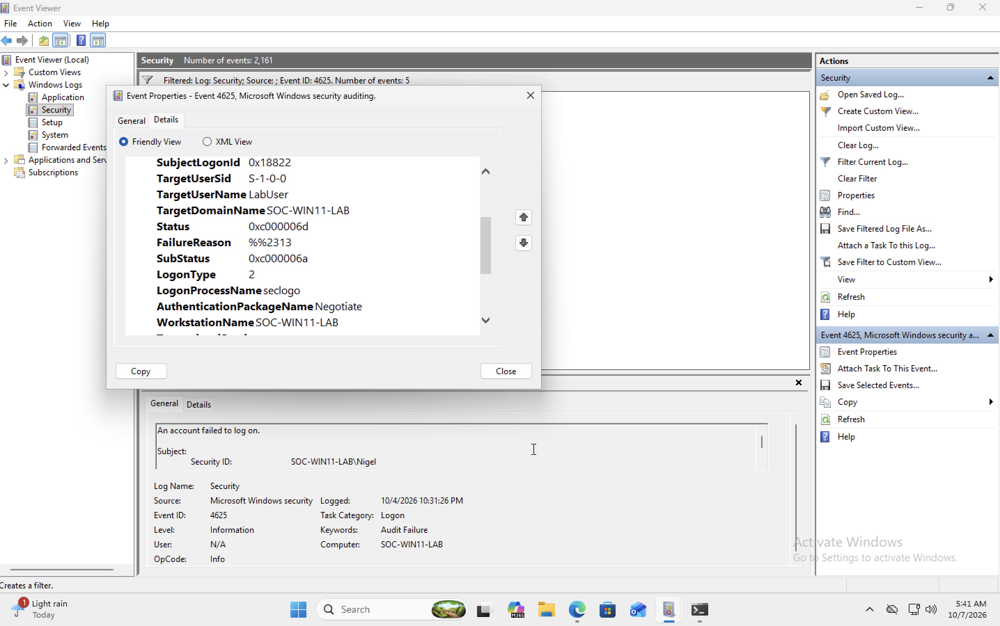

# Windows Failed Logon Investigation — Event ID 4625

## Objective

Investigate a failed Windows authentication attempt using Windows Security Event Logs and identify the cause of the failed logon.

## Lab Environment

- Windows 11 Pro
- UTM Virtual Machine
- Hostname: SOC-WIN11-LAB
- Windows Event Viewer
- Local test account: LabUser

## Scenario

A controlled failed authentication attempt was generated against the local `LabUser` account.

The Windows Security log was reviewed to identify the corresponding authentication failure.

## Detection

The Security log was filtered for:

**Event ID 4625 — An account failed to log on**

## Evidence

## Investigation Findings

The following fields were identified in the Windows Security event:

| Field | Value |
|---|---|
| Event ID | 4625 |
| Target User | LabUser |
| Target Domain | SOC-WIN11-LAB |
| Status | 0xC000006D |
| SubStatus | 0xC000006A |
| Logon Type | 2 |

## Analysis

Event ID 4625 indicates that a Windows account failed to authenticate.

The status code `0xC000006D` indicates a logon failure.

The substatus code `0xC000006A` indicates that the account was valid, but an incorrect password was supplied.

Logon Type `2` represents an interactive logon attempt, meaning the authentication attempt occurred locally on the system.

Based on the available evidence, the failed authentication attempt was caused by an incorrect password being entered for the `LabUser` account.

## Analyst Conclusion

The event was successfully identified and investigated using Windows Event Viewer.

This activity was generated intentionally in a controlled lab environment and does not represent an actual security incident.

## Skills Demonstrated

- Windows Event Log analysis
- Security Event ID investigation
- Authentication failure analysis
- Windows status and substatus interpretation
- SOC alert triage
- Incident documentation
